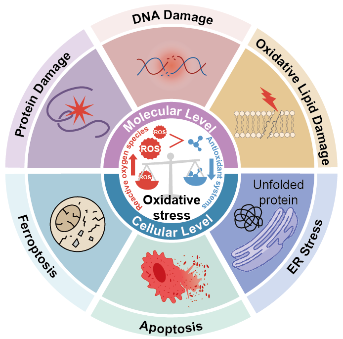

# OxStressNet: A Neural Network-Based Method for Quantitative Estimation of Oxidative Stress Levels
OxStressNet is a computational framework designed to quantitatively estimate oxidative stress activation across diverse biological contexts using transcriptomic data.

  

# 1. Overview
This repository contains the source code for the paper "OxStressNet: A Neural Network-Based Method for Quantitative Estimation of Oxidative Stress Levels." The directory is organized as follows:

- `code/01.OS.GSVA.score.R`: Computes initial oxidative stress-related scores using gene set variation analysis (GSVA) for curated marker gene sets, including
  - **M-O**: marker genes for ROS production score
  - **M-R**: marker genes for antioxidant response score
  - **M-OS**: marker genes for oxidative stress response and cellular damage score

- `code/02.neural.network.py`: Implements a neural network model that takes the GSVA-derived M-O, M-R, and M-OS scores as input and learns to predict the final oxidative stress level under biologically constrained relationships.
- `demo_data/exp.part01-04.rar`: Compressed RNA-seq demo dataset. This includes breast tissue RNA-seq expression data (TPM) for all protein-coding genes across cancer samples, adjacent noncancerous tissues, and normal tissues, compiled from TCGA and GTEx. Please unzip the files before use.
- `demo_data/sample.info.csv`: Sample metadata corresponding to the demo expression dataset.
  
# 2. Dependencies
- R == 4.4.3
- GSVA == 2.0.7
- Python == 3.13.2
- numpy == 2.1.3
- torch == 2.6.0
- scikit-learn == 1.6.1
- pandas == 2.2.3

# 3. Quick Start

1. Run GSVA scoring in R:
   source("code/01.OS.GSVA.score.R")
2. Run the neural network model:
   python code/02.neural.network.py

# 4. Contacts
If you have any questions, please email Jun Xiao (xiaojun20@mails.jlu.edu.cn)
